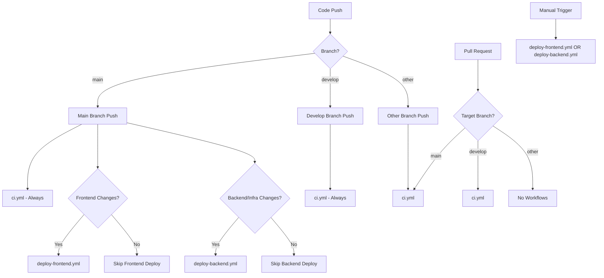

# CI/CD Workflows Documentation

## Overview

This document describes the GitHub Actions CI/CD workflows for the Setlista project. Our setup provides comprehensive testing, validation, and deployment capabilities with clear separation between CI and CD concerns.

## Workflow Files

| Workflow | File | Purpose | Status |
|----------|------|---------|--------|
| **CI** | `ci.yml` | Comprehensive testing and validation | ✅ Active |
| **Deploy Frontend** | `deploy-frontend.yml` | Frontend deployment to AWS | ✅ Active |
| **Deploy Backend** | `deploy-backend.yml` | Backend/infrastructure deployment | ✅ Active |

## Workflow Triggers and Flow Diagram



## Detailed Workflow Descriptions

### 1. CI Workflow (`ci.yml`)

**🎯 Purpose**: Primary continuous integration workflow with comprehensive testing

**⚡ Triggers**:
- Push to `main` or `develop` branches
- Pull requests to `main` branch

**🔧 Jobs**:
- **Frontend Testing**: Linting, testing, coverage
- **Backend Testing**: Linting, TypeScript compilation, testing, coverage  
- **Infrastructure Validation**: CDK synthesis

**📊 Outputs**: Coverage reports to Codecov

### 2. Deploy Frontend (`deploy-frontend.yml`)

**🎯 Purpose**: Deploy React application to AWS S3/CloudFront

**⚡ Triggers**:
- Push to `main` with changes in `frontend/**`
- Manual workflow dispatch

**🔧 Steps**:
1. Run tests
2. Build with production environment variables
3. Sync to S3 bucket
4. Invalidate CloudFront distribution

**🔐 Required Secrets**:
- `REACT_APP_API_URL`
- `REACT_APP_SPOTIFY_CLIENT_ID` 
- `REACT_APP_SPOTIFY_REDIRECT_URI`
- `AWS_ACCESS_KEY_ID`
- `AWS_SECRET_ACCESS_KEY`
- `S3_BUCKET_NAME`
- `CLOUDFRONT_DISTRIBUTION_ID`

### 3. Deploy Backend (`deploy-backend.yml`)

**🎯 Purpose**: Deploy backend API and infrastructure via AWS CDK

**⚡ Triggers**:
- Push to `main` with changes in `backend/**` or `infra/**`
- Manual workflow dispatch

**🔧 Steps**:
1. Test and build backend
2. Configure AWS credentials
3. Bootstrap CDK environment
4. Deploy infrastructure stack

**🔐 Required Secrets**:
- `AWS_ACCESS_KEY_ID`
- `AWS_SECRET_ACCESS_KEY`
- `SETLIST_FM_API_KEY`
- `SPOTIFY_CLIENT_ID`
- `SPOTIFY_CLIENT_SECRET`

**📍 Configuration**:
- AWS Account: `836481963552`
- AWS Region: `us-east-1`
- Stack Name: `SetlistaStack`


## Environment-Specific Behavior

### Development (`develop` branch)
- ✅ CI testing only
- ❌ No deployments
- 📊 Coverage reporting

### Production (`main` branch)
- ✅ CI testing
- ✅ Automatic deployments (if files changed)
- ✅ Manual deployments available
- 📊 Coverage reporting

### Feature Branches
- ✅ CI testing (on PRs only)
- ❌ No deployments

## Current Issues and Recommendations

### 🟢 Current Status
- ✅ All workflows are active and non-redundant
- ✅ Clean separation between CI and deployment workflows
- ✅ Efficient parallel execution

### 🟡 Recommendations
1. **Update Secrets**: Ensure GitHub secrets match current AWS resources
2. **Add Branch Protection**: Require CI checks before merging to `main`
3. **Monitor Performance**: Track workflow execution times and optimize if needed

### 🟢 Current Values for GitHub Secrets

Based on current AWS infrastructure:

```bash
S3_BUCKET_NAME=setlistastack-frontendbucketefe2e19c-xrgiygoshsb9
CLOUDFRONT_DISTRIBUTION_ID=E221UO4Z4ENMNC
```

## Performance Characteristics

- **Parallel Execution**: CI jobs run in parallel for faster feedback
- **Smart Triggers**: Deployments only run when relevant code changes
- **Caching**: npm dependencies cached across runs
- **Node.js 18**: Consistent runtime across all workflows

## Security Best Practices

- ✅ Secrets stored securely in GitHub
- ✅ AWS credentials scoped appropriately
- ✅ No hardcoded sensitive values in code
- ✅ Environment variables injected at build time

## Monitoring and Debugging

- **GitHub Actions Tab**: View workflow runs and logs
- **Codecov Dashboard**: Monitor test coverage trends
- **AWS CloudWatch**: Monitor deployed application health
- **CDK Outputs**: View infrastructure resource IDs

---

*This documentation should be updated when workflow configurations change.*